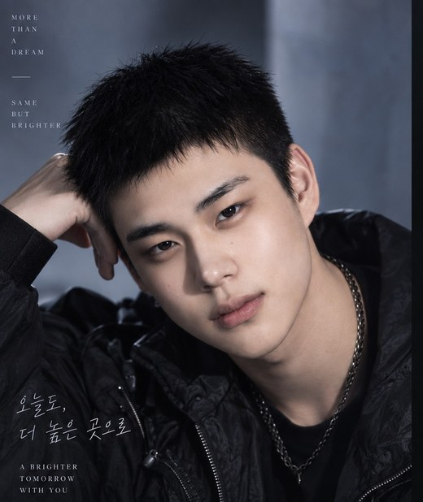

# CONES

> PROJECT: CONES — TWO ORIGINS, ONE SYSTEM.
> 이 문서는 CONES 프로젝트를 소개하는 공식 위키형 문서다.

**CONES**는 AI UNIT과 COMPUTER UNIT, 서로 다른 두 개의 기원(ONES)이 연결(CONnect)되어 하나의 시스템이 되어가는 과정을 그리는 팀 프로젝트다. 그룹명부터 세계관, 멤버 구성, 웹사이트 구조까지 전부 "연결(Connection)"이라는 하나의 키워드로 설계되어 있다.

첫 번째 프로젝트는 `PROJECT : CONNECTION : 00`이며, 데뷔 쇼케이스는 **2026.09.15**로 예정되어 있다. 공식 사이트는 [seune-h0203.github.io/cones](https://seune-h0203.github.io/cones/), 코드 저장소는 [github.com/seune-h0203/cones](https://github.com/seune-h0203/cones)다.

## 목차

- [1. 개요](#1-개요)
- [2. 멤버](#2-멤버)
  - [2.1. AI UNIT](#21-ai-unit)
  - [2.2. COMPUTER UNIT](#22-computer-unit)
  - [2.3. 멤버 간 케미](#23-멤버-간-케미)
- [3. 특징](#3-특징)
  - [3.1. 로고](#31-로고)
  - [3.2. 그룹명](#32-그룹명)
  - [3.3. 세계관](#33-세계관)
  - [3.4. 콘셉트](#34-콘셉트)
    - [3.4.1. 프로젝트 음악](#341-프로젝트-음악)
    - [3.4.2. 프로젝트 메시지](#342-프로젝트-메시지)
  - [3.5. 포지션](#35-포지션)
    - [3.5.1. THINK](#351-think)
    - [3.5.2. PREDICT](#352-predict)
    - [3.5.3. BUILD](#353-build)
    - [3.5.4. EXECUTE](#354-execute)
  - [3.6. 비주얼](#36-비주얼)
  - [3.7. 인기 및 기록](#37-인기-및-기록)
- [4. 프로젝트](#4-프로젝트)
  - [4.1. 프로젝트 소개](#41-프로젝트-소개)
  - [4.2. 프로젝트 목표](#42-프로젝트-목표)
  - [4.3. 프로젝트 진행 과정](#43-프로젝트-진행-과정)
- [5. 콘텐츠](#5-콘텐츠)
  - [5.1. 랜딩페이지](#51-랜딩페이지)
  - [5.2. GitHub](#52-github)
  - [5.3. 프로젝트 아카이빙](#53-프로젝트-아카이빙)
- [6. 활동](#6-활동)
  - [6.1. 회의](#61-회의)
  - [6.2. 개발](#62-개발)
  - [6.3. 프로젝트 발표](#63-프로젝트-발표)
  - [6.4. Daily Snapshot](#64-daily-snapshot)
- [7. 수상 및 성과](#7-수상-및-성과)
- [8. 여담](#8-여담)
- [부록: 기술 문서](#부록-기술-문서)

---

## 1. 개요

CONES는 AI UNIT과 COMPUTER UNIT이라는 두 개의 독립된 유닛이 하나의 시스템으로 연결되는 과정을 그린 프로젝트다. 그룹명 **CONES**는 **CON**necT + **ONES**(독립된 존재들)의 합성어로, "서로 다른 존재들이 연결되어 하나가 된다"는 세계관을 이름에서부터 압축해 담고 있다.

총 4명의 멤버로 구성되며, AI UNIT(THINK / PREDICT)과 COMPUTER UNIT(BUILD / EXECUTE)이 짝을 이뤄 하나의 순환 — THINK → PREDICT → BUILD → EXECUTE — 을 완성한다. 이는 곧 아이디어/기획 → 분석 → 개발 → 실행으로 이어지는 팀의 실제 협업 구조이기도 하다.

| 항목 | 내용 |
| --- | --- |
| 그룹명 | CONES |
| 슬로건 | TWO ORIGINS, ONE SYSTEM. |
| 구성 유닛 | AI UNIT, COMPUTER UNIT |
| 멤버 수 | 4인 |
| 소속 | CONES (CEO / DIRECTOR — 김남주) |
| 첫 프로젝트 | PROJECT : CONNECTION : 00 |
| 데뷔(예정) | 2026.09.15 |
| 공식 사이트 | https://seune-h0203.github.io/cones/ |

## 2. 멤버

<table>
<tr>
<td align="center" width="25%"><br><b>SERINA</b><br><sub>AI UNIT · LEARN</sub></td>
<td align="center" width="25%"><br><b>BAESAN</b><br><sub>AI UNIT · PREDICT</sub></td>
<td align="center" width="25%"><br><b>HYUN JIZEL</b><br><sub>COMPUTER UNIT · DESIGN</sub></td>
<td align="center" width="25%"><br><b>HAM BOM</b><br><sub>COMPUTER UNIT · EXECUTE</sub></td>
</tr>
</table>

| # | 이름 | 본명 | UNIT | ABILITY | 포지션 |
| --- | --- | --- | --- | --- | --- |
| 01 | **SERINA** (세리나) | 박세린 | AI UNIT | `LEARN` | MAIN DESIGNER |
| 02 | **BAESAN** (배산) | 배정호 | AI UNIT | `PREDICT` | MARKETING |
| 03 | **HYUN JIZEL** (현지젤) | 현세은 | COMPUTER UNIT | `DESIGN` | MAIN PLANNER |
| 04 | **HAM BOM** (함봄) | 함채림 | COMPUTER UNIT | `EXECUTE` | MAIN DEVELOPER |

> SERINA의 내부 id는 초기 기획 단계의 가명인 `rina`로 남아 있다. 라우트, 이미지 파일명, 티저 매니페스트 키가 이미 이 값을 쓰고 있어 하위 호환을 위해 유지했을 뿐, 화면에 노출되는 모든 표기는 SERINA / 세리나다.

### 2.1. AI UNIT

관측한 것을 해석하고, 아직 오지 않은 결과를 계산하는 유닛. 시스템의 "판단"을 담당한다.

- **SERINA** — 세리나 · 박세린. `LEARN` 담당, MAIN DESIGNER. 생일 2003.05.23. 특기는 수어. 팬덤은 "에아". 한 줄 소개: *"열심히 하겟습니다."*
- **BAESAN** — 배산 · 배정호. `PREDICT` 담당, MARKETING. 생일 2003.12.27. 특기는 끈기. 한 줄 소개: *"꿈이 크면 깨져도 크다"*

### 2.2. COMPUTER UNIT

판단을 구조로 옮기고, 구조를 현실에서 작동시키는 유닛. 시스템의 "실행"을 담당한다.

- **HYUN JIZEL** — 현지젤 · 현세은. `DESIGN` 담당, MAIN PLANNER. 생일 2006.02.03. 특기는 "기죽지 않는 깡다구". 한 줄 소개: *"JUST DO IT"*
- **HAM BOM** — 함봄 · 함채림. `EXECUTE` 담당, MAIN DEVELOPER. 나이 25세. 팬덤은 "피터". 한 줄 소개: *"이제 시작입니다!!"*

### 2.3. 멤버 간 케미

두 유닛은 서로 반대되는 역할이지만, `SystemCycle` 안에서 LEARN → PREDICT → DESIGN → EXECUTE 하나의 순환 고리로 연결된다. SERINA가 관측한 것을 BAESAN이 예측하고, 그 예측을 HYUN JIZEL이 구조로 옮기면 HAM BOM이 현실에서 실행한다 — 네 사람이 한 바퀴를 이루는 구조다.

아티스트 상세 화면에는 같은 유닛의 파트너가 함께 소개되는 로직(`getUnitPartner`)이 있어, AI UNIT 안에서는 SERINA ↔ BAESAN이, COMPUTER UNIT 안에서는 HYUN JIZEL ↔ HAM BOM이 서로의 짝으로 묶인다. 그 밖의 개인적인 케미·에피소드는 추후 업데이트 예정.

## 3. 특징

### 3.1. 로고

CONES 워드마크는 정적인 이미지가 아니라 하나의 인터랙션(`LogoMark`)이다. 전원이 켜지듯 와이프로 드러나고, 워드마크 실루엣을 따라 크롬(chrome) 하이라이트가 흐르며, 숨 쉬듯 은은한 글로우가 번진다. `prefers-reduced-motion` 환경에서는 이 연출이 전부 정적인 로고로 대체된다.

### 3.2. 그룹명

**CONES = CON(nect) + ONES(독립된 존재들).**

서로 혼자서는 시스템을 완성할 수 없는 독립된 존재들이 연결되어 하나의 시스템이 된다는 뜻을, 이름 자체에 압축해 담았다.

### 3.3. 세계관

CONES의 세계관은 두 개의 기원 — AI UNIT과 COMPUTER UNIT — 이 하나로 수렴하는 과정이다.

```
O        O   →   O + O   →   ∞   →   CONES
AI UNIT      COMPUTER UNIT
```

두 개의 원이 서로 다가가 겹치고, 무한대 기호로 수렴한 뒤 워드마크가 드러난다. 이 장면은 미리 만든 영상이 아니라 스크롤 위치에 실시간으로 반응하는 SVG 시퀀스(`ConnectionSequence`)로 구현되어 있다.

같은 논리가 멤버들의 순환에도 반복된다.

```
LEARN → PREDICT → DESIGN → EXECUTE → LEARN → … → ∞
```

`SystemCycle`은 이 네 단계를 하나의 루프로 그리며, 각 단계는 해당 ABILITY를 가진 멤버로 바로 연결된다. 세계관과 멤버 소개가 서로 다른 두 섹션이 아니라 하나의 이야기로 이어지는 이유다.

### 3.4. 콘셉트

#### 3.4.1. 프로젝트 음악

추후 업데이트 예정.

#### 3.4.2. 프로젝트 메시지

> FOUR MINDS. TWO ORIGINS. ONE SYSTEM.
> TWO ORIGINS, ONE SYSTEM.

네 개의 마음(멤버), 두 개의 기원(유닛), 하나의 시스템(CONES)으로 요약되는 메시지. 사이트의 첫 화면과 마지막 화면에 같은 문구가 반복 등장하며, 시작과 끝을 같은 문장으로 닫는다.

### 3.5. 포지션

CONES의 포지션은 유닛 단위의 네 단계 흐름 — **THINK → PREDICT → BUILD → EXECUTE**로 설명된다. 실제 사이트/코드의 ABILITY 명칭은 이보다 한 단계 더 구체적인 `LEARN / PREDICT / DESIGN / EXECUTE`로 구현되어 있으며, 아래 각 항목에서 이 둘의 관계를 밝힌다.

#### 3.5.1. THINK

AI UNIT의 첫 단계. 관측하고 축적하는 역할로, 사이트에는 `LEARN`이라는 이름의 ABILITY로 구현되어 있다. 담당은 **SERINA**.

#### 3.5.2. PREDICT

AI UNIT의 두 번째 단계. 축적된 패턴 위에서 갈라지는 미래를 계산한다. ABILITY 명칭도 동일하게 `PREDICT`. 담당은 **BAESAN**.

#### 3.5.3. BUILD

COMPUTER UNIT의 첫 단계. 예측을 구조와 도면으로 옮기는 역할로, 사이트에는 `DESIGN`이라는 이름의 ABILITY로 구현되어 있다. 담당은 **HYUN JIZEL**.

#### 3.5.4. EXECUTE

COMPUTER UNIT의 두 번째 단계. 설계를 현실에서 실제로 작동시킨다. ABILITY 명칭도 동일하게 `EXECUTE`. 담당은 **HAM BOM**.

### 3.6. 비주얼

멤버별 ABILITY는 각자 고유한 SVG 비주얼 언어(`AbilityMotif`)를 가진다.

| ABILITY | 비주얼 언어 |
| --- | --- |
| LEARN | 데이터 포인트, 스캐닝 라인, 관측 |
| PREDICT | 하나의 기원에서 갈라져 나가는 미래들 |
| DESIGN | 블루프린트 프레임, 가이드, 구조 |
| EXECUTE | 활성화되는 바, 움직이는 포인터 |

전체 톤은 블랙(`#050506`) & 화이트(`#f4f4f2`) 베이스에 실버(`#b9bcc3`)와 크롬 그라디언트를 포인트로 쓴다. 외부 폰트 서비스 없이 시스템 폰트만으로 디스플레이/본문/모노스페이스 타이포를 구성해, 인터넷 연결 없이도 항상 같은 화면을 보여준다. 디렉터 프로필 사진은 흑백(grayscale) 톤으로 맞춰 멤버 사진들과 분위기를 통일했다.

### 3.7. 인기 및 기록

CONES는 아직 데뷔 전(pre-debut) 단계다. 별도의 인기 지표나 기록은 없으며, 데뷔 쇼케이스(2026.09.15) 이후 업데이트 예정.

## 4. 프로젝트

### 4.1. 프로젝트 소개

`PROJECT : CONNECTION : 00`은 CONES의 첫 번째 프로젝트다. `00`은 두 개의 원이자, 동시에 "아직 아무것도 정해지지 않았다"는 뜻으로 읽힌다. 그래서 이 프로젝트는 새 이미지를 따로 만들지 않고, 세계관에서 쓰인 것과 같은 시각 문법(두 원 → 연결 → 순환)을 그대로 반복해 보여준다.

### 4.2. 프로젝트 목표

두 기원(AI UNIT, COMPUTER UNIT)이 실제로 하나의 시스템으로 연결될 수 있다는 것을 증명하는 것. 사이트의 카운트다운과 상태 문구(`COMING SOON` / `NOW LIVE`)는 데뷔 쇼케이스 시각을 기준으로 하나의 로직에서 동작하므로, 어느 섹션을 보든 상태가 서로 어긋나지 않는다.

### 4.3. 프로젝트 진행 과정

| 일자 | 내용 |
| --- | --- |
| 2026.09.09 | 최초 커밋. 랜딩페이지 골격 및 GitHub Pages 배포 워크플로 구성 |
| 2026.09.10 | RINA → SERINA 표기 정리, About 페이지에 디렉터 프로필 추가, README 한글화 |
| 2026.09.12 | 여러 페이지로 나뉘어 있던 구조를 One Page Landing Page로 통합, 아티스트 프로필 모달 도입, 홈 화면에 디렉터 섹션 분리 추가, README를 위키형 문서 구조로 전면 개편 |

## 5. 콘텐츠

### 5.1. 랜딩페이지

원래 CONES 사이트는 Home / World / Artists / Artist Detail / Project / About / NotFound로 나뉜 다중 페이지 구조였다. 이 구조를 하나의 페이지로 통합해, 지금은 `/` 한 곳에서 스크롤만으로 CONES의 세계관 · 멤버 · 유닛 · 프로젝트 정보를 전부 확인할 수 있다.

- 기존에 여러 라우트로 흩어져 있던 콘텐츠(세계관, 멤버 로스터, 시스템 순환, 프로젝트, 팀, 디렉터)를 전부 한 페이지 안의 섹션으로 재배치했다.
- 히어로 → ORIGINS → CONNECTION → SYSTEM CYCLE → ARTISTS → PROJECT → TEAM → DIRECTOR → CTA 순서로, 스크롤을 내리는 것 자체가 CONES 세계관을 처음부터 끝까지 훑는 경험이 되도록 구성했다.
- 아티스트 카드를 클릭하면 페이지 이동 없이 모달로 상세 프로필이 열려, 스크롤의 흐름이 끊기지 않는다.
- 이 랜딩페이지가 곧 CONES의 대표 얼굴이다. 그룹으로서의 세계관과 실제로 배포된 웹사이트가 이 한 페이지 안에서 정확히 일치한다.
- 라이브 주소: **https://seune-h0203.github.io/cones/**

### 5.2. GitHub

CONES의 모든 코드와 제작 과정은 GitHub 저장소에 공개되어 있다.

- 저장소: [seune-h0203/cones](https://github.com/seune-h0203/cones)
- 배포: `main` 브랜치에 push될 때마다 GitHub Actions가 빌드 후 GitHub Pages로 자동 배포한다.
- 이슈 트래커에는 `[PLAN]` `[FE]` `[DESIGN]` `[QA]` `[CONTENT]` `[DEPLOY]` `[PRESENTATION]` 카테고리와 담당 멤버(SERINA / BAESAN / HYUN JIZEL / HAM BOM), 진행 상태를 기록한다.
- 협업 방식에 대한 자세한 내용은 [부록의 "GitHub 협업"](#부록-기술-문서) 항목 참고.

### 5.3. 프로젝트 아카이빙

- 멤버별 포트레이트, 16:9 티저 포스터, OG 카드 이미지는 `public/images`에 아카이빙되어 있다.
- 티저 영상은 `public/videos/manifest.json`으로 관리된다. 현재는 **BAESAN** 티저만 실제로 등록되어 있고, 나머지 멤버는 포트레이트를 포스터로 띄운 `SIGNAL PENDING` 상태로 표시된다. 존재하지 않는 영상을 지어내 채우지 않는 것이 원칙이다.
- 이 README 자체도 아카이브의 일부다. 프로젝트가 진행되는 동안 계속 갱신된다.

## 6. 활동

### 6.1. 회의

추후 업데이트 예정.

### 6.2. 개발

React 19 + TypeScript(strict) + Vite로 개발되었으며, UI/애니메이션 라이브러리 없이 네이티브 CSS/DOM/SVG로 모든 인터랙션을 구현했다. 자세한 스택과 폴더 구조는 [부록: 기술 문서](#부록-기술-문서) 참고.

### 6.3. 프로젝트 발표

데뷔 쇼케이스는 **2026.09.15**로 예정되어 있다. 발표 관련 세부 내용은 추후 업데이트 예정.

### 6.4. Daily Snapshot

#### 2026.09.09

- 프로젝트 최초 커밋
- 랜딩페이지 초기 구조 및 GitHub Pages 배포 워크플로 구성

#### 2026.09.10

- RINA → SERINA 표기 정리
- About 페이지에 디렉터(김남주) 프로필 추가
- README 한글화

#### 2026.09.12

- 여러 페이지로 나뉘어 있던 구조를 One Page Landing Page로 통합
- 아티스트 프로필 모달 추가
- 홈 화면에 디렉터 섹션을 별도 구성으로 분리 추가
- README 구조 개편 — 위키형 프로젝트 문서 구조 적용

## 7. 수상 및 성과

아직 없음. CONES는 데뷔 전(pre-debut) 프로젝트로, 수상 및 성과는 추후 업데이트 예정.

## 8. 여담

- 그룹명 CONES는 CON(nect) + ONES(독립된 존재들)의 합성어다.
- SERINA의 내부 id는 초기 기획 단계의 가명인 `rina`로 남아 있다. 라우트, 이미지 파일명, 티저 매니페스트 키가 이미 이 값을 쓰고 있어 하위 호환을 위해 유지했다. 화면에는 전부 SERINA / 세리나로만 노출된다.
- 사이트에는 문서화되지 않은 이스터에그가 하나 숨어 있다. 존재한다는 사실만 여기에 적어둔다.
- 사이트는 외부 CDN이나 폰트 서비스를 전혀 쓰지 않는다. 빌드 결과물 하나만 있으면 인터넷 연결 없이도 동작한다.
- 랜딩페이지는 원래 Home / World / Artists / Artist Detail / Project / About 등 여러 페이지로 나뉘어 있었다. 지금은 하나의 페이지로 합쳐졌고, 예전 페이지 파일들은 코드베이스에 남아 있지만 더 이상 화면에 연결되어 있지 않다.
- 데뷔 쇼케이스일(2026.09.15)은 GitHub 마일스톤 "CONES — FINAL SUBMISSION"의 마감일과 같다.

---

## 부록: 기술 문서

여기부터는 위 소개와 별개로, CONES를 실제로 만들고 배포하는 데 필요한 개발 정보를 정리한 영역이다.

### 기술 스택

React 19 · TypeScript(strict) · Vite. UI/애니메이션 라이브러리 없이 네이티브 CSS/DOM/SVG로 모든 인터랙션을 구현했다.

### 프로젝트 구조

```
src/
├─ components/   Navbar, ArtistCard, ArtistProfileModal, LogoMark, TeaserVideo, TeaserPlayer,
│                VideoModal, Countdown, ConnectionSequence, SystemCycle,
│                AbilityMotif, LoadingScreen, PageTransition, CustomCursor,
│                EasterEgg, Footer, Reveal, SectionHeader …
├─ pages/        Home (현재 렌더링되는 유일한 페이지) · World / Artists / ArtistDetail /
│                Project / About / NotFound (레거시, 더 이상 라우팅되지 않음)
├─ data/         artists.ts (멤버 단일 소스), site.ts (브랜드, 디렉터, 데뷔 일자, 유닛 카피, 시스템 순환)
├─ hooks/        useCountdown, useInView, useScrollProgress, useTeaser,
│                useSeo, useFocusTrap / useScrollLock, useMedia
├─ utils/        asset.ts (배포 환경에 안전한 경로 해석), analytics.ts
└─ styles/       tokens.css (디자인 토큰), global.css (프리미티브)

public/
├─ images/       멤버 포트레이트 · 16:9 티저 포스터 · OG 카드 · 로고
└─ videos/       티저 파일 + manifest.json
```

`App.tsx`는 더 이상 `react-router-dom`의 라우트를 렌더링하지 않고 `Home` 하나만 렌더링한다. 과거 다중 페이지 구조의 흔적인 `World` / `Artists` / `ArtistDetail` / `Project` / `About` / `NotFound`는 파일로는 남아 있지만 화면에는 연결되어 있지 않다. `react-router-dom`은 `package.json`의 의존성으로는 남아 있지만 현재 렌더링 경로에서는 쓰이지 않는다.

### 티저 비디오 시스템

모든 멤버는 `public/videos/manifest.json`에 선언된 티저 슬롯을 가진다.

```json
{
  "teasers": {
    "baesan": {
      "desktop": "baesan-teaser.mp4"
    }
  }
}
```

- `desktop`은 필수, `mobile`(9:16 컷)은 좁은 뷰포트에서 자동 선택된다.
- manifest에 등록되지 않은 멤버는 실제 포트레이트를 포스터로 띄우고 `SIGNAL PENDING` 상태로 표시한다. 없는 영상을 지어내 채우지 않는다.
- `IntersectionObserver`로 화면에 보일 때만 재생하고 벗어나면 즉시 정지하며, 동시에 두 개 이상 디코딩되지 않는다.

### GitHub 협업

- **GitHub Issues** — `[PLAN]` `[FE]` `[DESIGN]` `[QA]` `[CONTENT]` `[DEPLOY]` `[PRESENTATION]` 카테고리 라벨과 `STATUS: BACKLOG / READY / IN PROGRESS / DONE` 상태 라벨로 작업을 관리한다.
- **GitHub Projects / Milestone** — "CONES — FINAL SUBMISSION" 마일스톤으로 전체 작업을 하나의 마감일(2026.09.15)에 맞춰 추적한다. 별도의 Projects 보드 구성은 추후 업데이트 예정.
- **팀원별 역할** — 이슈마다 표 형식으로 담당(SERINA / BAESAN / HYUN JIZEL / HAM BOM), Kanban 상태, Story Point를 기록한다. 작업 단위가 CONES 네 멤버 이름으로 배분되어 있다.
- **Branch / PR** — 현재는 `main` 단일 브랜치로 운영 중이며, 별도 브랜치 전략과 PR 리뷰 프로세스는 추후 업데이트 예정.

### 배포

- 저장소: [seune-h0203/cones](https://github.com/seune-h0203/cones)
- 라이브: https://seune-h0203.github.io/cones/
- `.github/workflows/deploy.yml`이 `main` push마다 `npm run build` 후 `actions/deploy-pages`로 GitHub Pages에 배포한다.
- `vite.config.ts`의 `base: "./"` 덕분에 모든 에셋이 상대 경로로 해석되어, 도메인 루트든 GitHub Pages 하위 경로든 수정 없이 동작한다.

```bash
npm install
npm run dev        # http://localhost:5173
npm run build      # tsc --noEmit + 프로덕션 빌드 → dist/
npm run preview    # 프로덕션 빌드를 로컬에서 서빙
```

네트워크 없이 배포하려면:

```bash
npm run build:offline
npm run serve:dist
```

외부 CDN이나 Google Fonts를 쓰지 않으므로, `dist/` 폴더 하나만 옮기면 USB · 사내 서버 · 정적 호스팅 어디서든 인터넷 연결 없이 CONES가 동작한다. 브라우저 보안 정책상 `index.html`을 `file://`로 직접 여는 대신 작은 정적 서버를 사용해야 한다.

### 접근성 & 성능

- 시맨틱 랜드마크, 실제 `<button>` / `<a>` 요소, 의미 있는 이미지의 `alt` 텍스트, 본문 바로가기 링크를 갖췄다.
- 모든 애니메이션은 `prefers-reduced-motion: reduce`에서 정지 상태로 축소된다.
- 컴포넌트 단위 코드 스플리팅, `srcset` 기반 이미지, `loading="lazy"`를 사용한다.
- 런타임 의존성은 `react`, `react-dom`, `react-router-dom` 세 가지뿐이고(단, `react-router-dom`은 앞서 설명한 대로 현재 라우팅에는 쓰이지 않는다), UI/애니메이션 라이브러리는 0개다.

---

**CONES** · TWO ORIGINS, ONE SYSTEM.
`PROJECT : CONNECTION : 00` — DEBUT SHOWCASE `09.15.2026`
